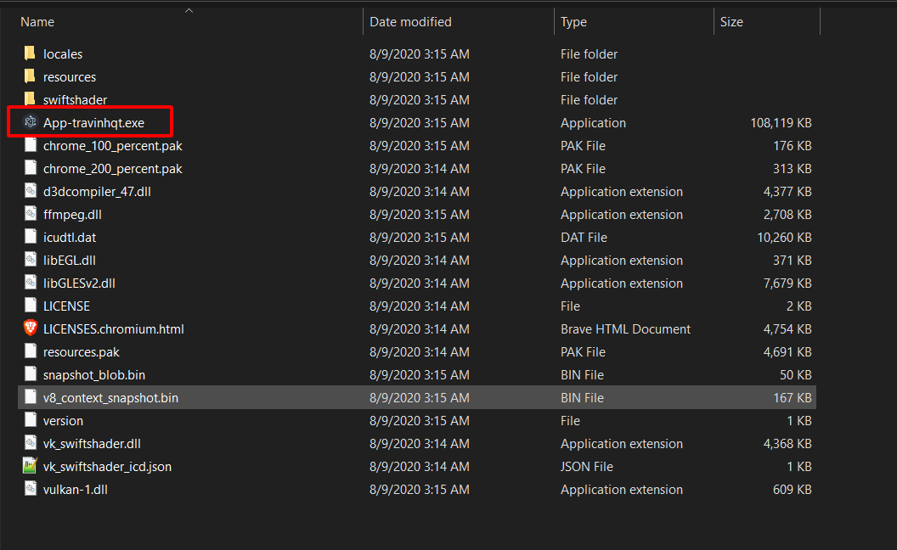
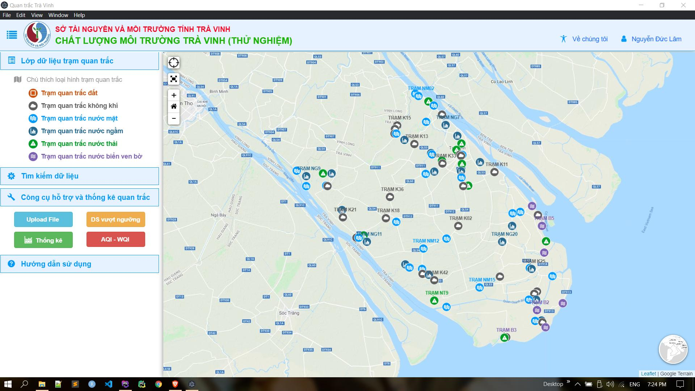

# App Desktop using Electron JS
### Preferences:
- Electron JS: https://www.electronjs.org/
- Electron Browser website: https://github.com/jamzi/electron-quick-start/tree/electron-website-end
- My website: http://210.245.96.138/travinhqt_laravel/webapp

### How to run myapp
- Clone my github repo: `git clone https://github.com/nguyenduclam/Electron_JS_FirstApp.git`
- Run code `npm install`
- Run code `npm run build`

### Result

